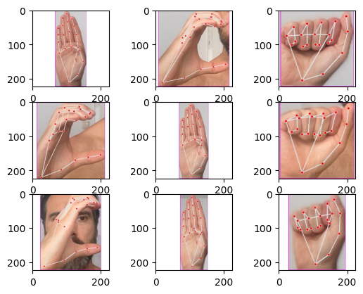

# Development of a Hand Gesture Classifier with Deep Learning for Sign Language Interpretation

Christian Göran

## Table of Contents

1. [Purpose and Background](#purpose-and-background)
2. [Methodology and Data](#methodology-and-data)
3. [Results and Data Analysis](#results-and-data-analysis)
4. [Interpretation and Conclusions](#interpretation-and-conclusions)
5. [References](#references)

## Purpose and Background

The problem I aim to solve is developing a machine learning model that can recognize hand gestures representing letters of the alphabet. This could be used in applications such as sign language interpretation or gesture-based control of devices. The model should be able to take a picture, preprocess it, and then classify which letter the hand gesture represents. Alternatively, the model should be able to perform live interpretation of hand gestures via a webcam, displaying the prediction as a label over the video.

Project Links:

- Real-time interpretation via webcam is the version being found here on this rep.
- Take a picture and then let the model interpret it: [Google Colab Notebook](https://colab.research.google.com/drive/1g1H45kT9NdMPqaGol3DsFKn2spk0dN6G?usp=sharing)

## Installation

Clone the repository and install the required dependencies.

```

git clone https://github.com/yourusername/sign-language-detection.git
cd sign-language-detection

# Set up a virtual environment (optional but recommended)

python -m venv myenv
source myenv/bin/activate # On Windows use `myenv\Scripts\activate`

# Install dependencies

pip install -r requirements.txt

```

## Dataset Preparation

Collect images for each ASL alphabet and prepare the dataset.

1. **Image Collection**:
   - Run the `collect_images.py` script to capture images of hand gestures for each alphabet.
   - Adjust the `folder` variable to specify which letter you are collecting images for.

```
python collect_images.py
```

2. **Create Dataset**:
   - Run the `create_dataset.py` script to process the collected images and save them into a dataset.

```
python create_dataset.py
```

## Methodology and Data

The dataset used to train the model consists of images of hand gestures representing the letters “A”, “B”, and “C” of the alphabet. Due to time constraints, I chose to limit the number of classifiable letters to just three.

The images are taken with a webcam and are organized into folders where each folder corresponds to a letter. Each image is 224x224 pixels in size and in color (RGB). The images were preprocessed by normalizing them (scale 0-1 from the normal pixel value of 0 - 255) and resizing them to match the model's input format.

To capture the necessary images, I built an application using OpenCV’s Hand Detection model to plot 21 points representing all the joints in the hand and a module called Open Source Computer Vision Library (cv2) to use the computer’s webcam.

The file is named `collect_images.py` and can be found under Github Repository.

Below are examples of how the images look.



I chose to use a pre-trained VGG16 model as the basis for my model. VGG16 is a deep convolutional network model effective for image classification tasks. I froze the pre-trained layers in VGG16 and added fully connected layers on top to adapt it to the specific task.

The model consists of the following layers:

- VGG16 base
- Flatten layer
- Dense layer with 256 neurons and ReLU activation function
- Dense layer with a number of neurons corresponding to the number of classes and a softmax activation function

Hyperparameters:

- Optimizer: Adam
- Loss function: Categorical Crossentropy
- Batch size: 32
- Epochs: 10

Validation data was also used to monitor the model's performance during training and to identify any overfitting or underfitting.

There are two different versions of the final application:

- Real-time interpretation via webcam: Available under Github Repository.
- Take a picture and then let the model interpret it: Due to the limited capabilities of Google Colab to use the computer’s webcam, I had to come up with another solution where the webcam is activated, a picture is taken, and then this picture is fed to the model for gesture interpretation. Available in Google Colab Notebook.

## Training the Model

Train the VGG16 model using the prepared dataset.

```
python train_vgg16.py
```

## Running the Model

Use the trained model to recognize hand gestures in real-time via a webcam.

```
python run_model.py
```

## Results and Data Analysis

During training, both training and validation accuracy as well as loss were monitored:

- The model achieved high training and validation accuracy of 1.0 (100%) almost immediately over the 10 epochs, indicating high performance on the task.
- Training and validation loss quickly approached near zero and remained there throughout the training process.

Evaluation of the model:

- The model was evaluated with the validation set and achieved an accuracy of 1.0, perfectly identifying the validation data.

Model for real-time interpretation: In tests of real-time interpretation using the model, it correctly interpreted the three different hand gestures.

Model for analyzing already taken photos: In tests of the Google Colab model, it also correctly interpreted the hand gestures.


## Interpretation and Conclusions

The perfect accuracy and extremely low loss on both training and validation data might indicate that the model has become very good at predicting all the training and validation data. This can happen if the dataset is too small or too simple, or if there is some form of leakage between training and validation data. However, in this case, it is most likely due to a very limited dataset.

Although the result shows perfect performance, it is not common to achieve such good performance so quickly and steadily. It is probably an indication that the model is overfitted to the data and that the data is not sufficiently varied.

That being said, this project demonstrates that a pre-trained VGG16 model can successfully be used to recognize hand gestures in sign language. The model can be extended to include more sign language gestures. Future work may involve collecting more varied datasets and exploring other deep learning architectures to improve and expand the model's capabilities, as well as including hand gestures that require movement beyond the gesture to convey meaning.

## References

- Murtaza’s Workshop - Robotics and AI - [YouTube](https://www.youtube.com/watch?v=wa2ARoUUdU8&t=2201s)
- Kelvinanidi’s Sign-Language-Detection repository - [Github](https://github.com/kelvintanidi/Sign-Language-Detection/blob/master/Sign_Language_Detection.ipynb)
- Computer Vision Engineer - [YouTube](https://www.youtube.com/watch?v=MJCSjXepaAM&t=543s)
- and associated [Github Repository](https://github.com/computervisioneng/sign-language-detector-python)
- LearnOpenCV - Hand Keypoint detection using Deep Learning and OpenCV - [LearnOpenCV](https://github.com/computervisioneng/sign-language-detector-python)
- Google Mediapipe - Hand landmarks detection guide for Python - [Google Mediapipe](https://ai.google.dev/edge/mediapipe/solutions/vision/hand_landmarker/python)
- OpenCV (cv2) - Library for real-time computer vision - [PyPI](https://pypi.org/project/opencv-python/)

## Tech Stack

- OpenCV using webcam to capture dataset images
- Mediapipe provides a suite of libraries that can be used. We will use:
  - Landmark for hand landmark detection
    Mediapipe Hand Landmark Detection website
    Github repository

## Encountered Bugs & Problems

- The webcam doesn't seem to be accessed correctly

  - Resolution: Entered a webcam index that starts with '0' and goes up until it works

- The model is not working properly. It is identifying the wrong letters.
  - I tried using another pre-trained model (RandomForestClassifier) but this didn't make any difference.
  - I retrained the model, this actually made the model predict different kinds of letters when testing.
  - I ended up rewriting my entire image capturing script, implementing handDetection into the image collection phase and cropped each image to just include the hand, also capping the size at 224x224 pixels of each image so I could run them through the VGG16 pre-trained model.

## Contributing

Contributions are welcome! Please create an issue or submit a pull request for any improvements or bug fixes.

### Description of Each Script

#### `collect_images.py`

This script captures images of hand gestures for different ASL alphabets using a webcam and saves them to the specified directory.

#### `create_dataset.py`

Processes the collected images, extracts hand landmarks, and prepares a dataset for training.

#### `train_vgg16.py`

Trains a VGG16 model on the prepared dataset. The model is then saved for later use in real-time gesture recognition.

#### `run_model.py`

Uses the trained VGG16 model to recognize hand gestures in real-time from a webcam feed and displays the predicted alphabet on the screen.
